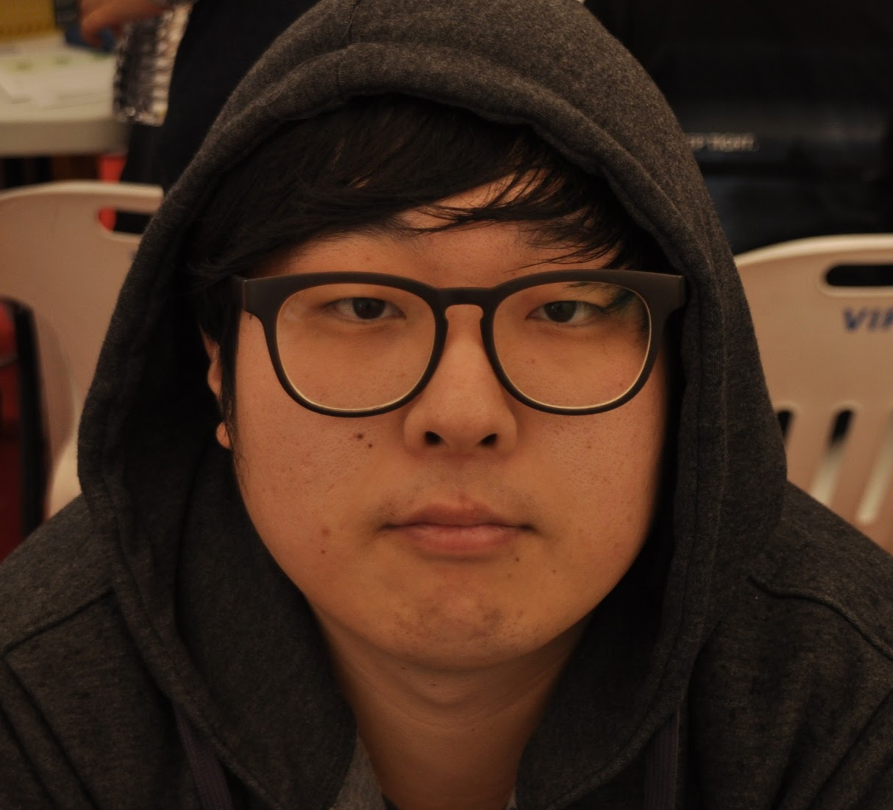

## About Me

Hi!, My Name is Jason Kim (Korean Name is Kim Seok Yong).
I'm Android / PHP Developer, I'd work for Oponiti provided mobile game coupons, launches, updates and information on mobile games and coupons to gamers. The cumulative number of installed services was 800,000, but currently (January 2017 sale) is not serviced by oponiti.
In addition, we have developed AllBus, a charter bus comparison service, which was difficult to compare and complex.

## Skills
- Android (Kotlin / Java)
  - My most basic skills are understanding of Android Framwork and Kotlin / Java.
- BackEnd (PHP)
  - My understanding of the backend is less than a year old, but I am ready to learn and learn more structures and techniques.
- iOS (Swift)

## Projects

- AllBus (Android / Backend)
   - http://allbus.kr

- GameShuttle (Android)
   - http://gameshuttle.kr

- HongNavi (Android)

## Career
- Oponiti (Developer)
   - 14-09-16 ~ Now

## PersonalActivity
- Google Developer Group Incheon (Organizer) [GooglePlus](https://plus.google.com/communities/104783014618153871181)
[meetup](https://www.meetup.com/GDG-Incheon/)
[latestMeetup](https://sites.google.com/view/io-extended-incheon-17)
   - Google Developer Groups (GDGs) are for developers who are interested in Google's developer technology.
   - Operating Google Tech Seminar & Study & Something..
   - We are Catch phrase is "Coding For a Better World"

- Code For Incheon (http://codeforincheon.org/)
   - We are a civic engagement meeting to solve community problems with public technology and IT.